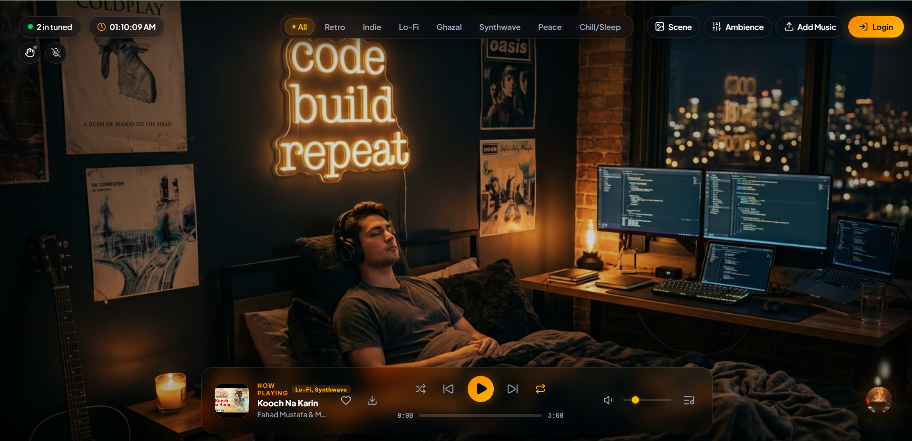
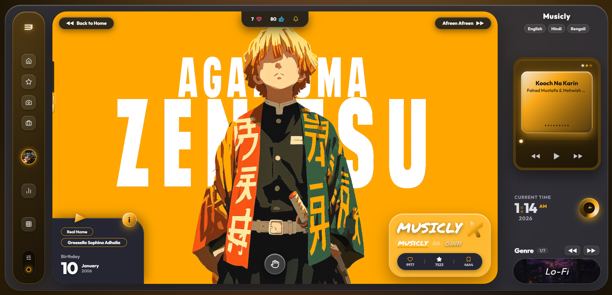
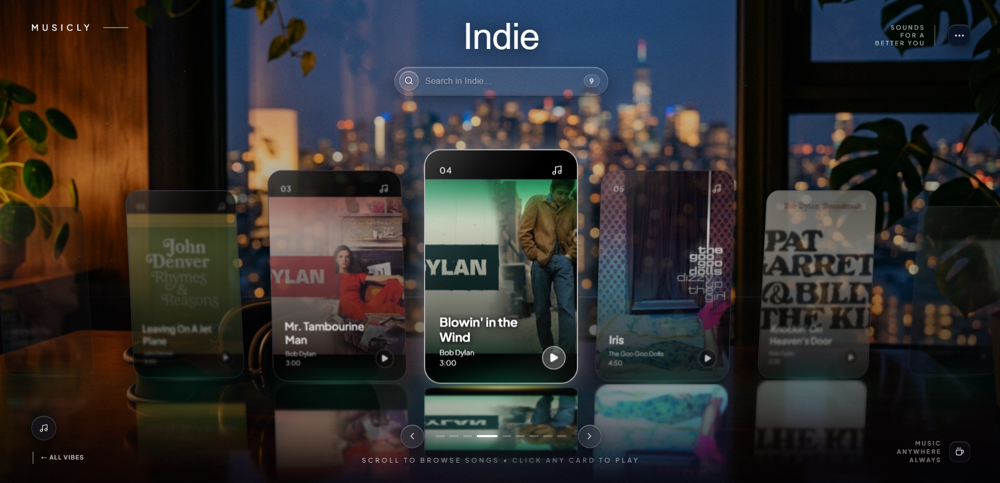

 <div align="center">


<br />


### A little less noise. A little more music.

**Your music. Your mood. Your own little universe.**

An immersive music experience where sound, atmosphere, and visual storytelling come together. Tune into a mood, settle into a scene, and make the moment your own.

<br />

<a href="[PASTE_YOUR_DEPLOYED_WEBSITE_LINK_HERE](https://musicly2-0.vercel.app/)">🌐 **EXPLORE MUSICLY**</a>
&nbsp; · &nbsp;
<a href="https://github.com/Tripam007/Musicly2.0">💻 **SOURCE CODE**</a>

</div>

---

## ✦ ABOUT MUSICLY

Musicly is more than a music player. It's a personal space where music meets mood, ambience, and immersive visuals.

Whether you're coding late at night, relaxing after a long day, studying, or simply getting lost in your favourite songs, Musicly lets you create an atmosphere that feels like yours.

Built with a focus on cinematic visuals, smooth interactions, and a distraction-free listening experience.

---

## ◈ THE EXPERIENCE

<div align="center">



**01 — THE HOME EXPERIENCE**

*An immersive listening space with cinematic visuals, warm lighting, and a floating music player.*

</div>

<br />

<table>
<tr>
<td width="50%" align="center" valign="top">



### 02 — PERSONALIZATION

A distinctive interface for exploring music, personal listening preferences, and interactive features.

</td>
<td width="50%" align="center" valign="top">



### 03 — INDIE SCENE

Atmospheric visuals, layered music cards, and a cinematic scene built around the mood of music.

</td>
</tr>
</table>

---

## ✧ FEATURES

- 🎵 **Mood-Based Listening** — Explore music through genres and moods.
- 🌌 **Cinematic Scenes** — Change the visual atmosphere to suit your moment.
- 🌧️ **Ambient Soundscapes** — Pair music with atmospheric sounds.
- 🎧 **Personal Music Library** — Manage and enjoy your music collection.
- 🎙️ **Voice Interaction** — Explore hands-free music control through voice commands.
- 🖐️ **Gesture Controls** — Interact with music using supported hand gestures.
- ☕ **Support Musicly** — Help keep the project growing through the built-in coffee donation feature.
- ✨ **Immersive Interface** — Dark visuals, glass-inspired surfaces, subtle lighting, and smooth transitions.

---

## ⌘ TECHNOLOGY STACK

| Technology | Purpose |
|---|---|
| ⚛️ React | Interactive user interface |
| ⚡ Vite | Development and production build |
| 🟨 JavaScript | Application logic |
| 🔥 Firebase | Authentication and backend services |
| 🎨 CSS | Responsive styling, animations, and visual effects |
| ☁️ Google Cloud | Voice-related services, where configured |
| 🖐️ MediaPipe | Hand gesture recognition, where integrated |

*The exact services enabled depend on the current project configuration.*

---

## 🚀 GETTING STARTED

Want to explore Musicly locally? Follow these steps.

**1. Clone the repository**

```bash
git clone https://github.com/Tripam007/Musicly2.0.git
```

**2. Navigate to the project**

```bash
cd Musicly2.0
```

**3. Install dependencies**

```bash
npm install
```

**4. Configure environment variables**

Create a `.env` file if your local setup requires environment variables. Add your Firebase and other service configuration using the variable names expected by the project.

**Never commit private API keys, service-account credentials, or other secrets to GitHub.**

**5. Start the development server**

```bash
npm run dev
```

Open the local URL shown in your terminal to experience Musicly.

**6. Build for production**

```bash
npm run build
```

---

## 🌒 THE ROAD AHEAD

Musicly is an evolving project, with room to explore:

- More immersive scenes and visual environments
- Smarter voice-based interactions
- Improved gesture recognition
- More personalization and accessibility
- Further performance and mobile experience improvements

---

## ☕ SUPPORT THE EXPERIENCE

Musicly is an independent project created for personal listening and experimentation.

If you enjoy the experience, consider supporting its development and helping keep the lights on.

*Only upload or publicly distribute tracks when you have the necessary rights or permission.*

---

## ♡ CONNECT

<div align="center">

**Created with curiosity, code, and a love for music.**

<br />

<a href="https://github.com/Tripam007">GitHub</a>
&nbsp; · &nbsp;
<a href="https://musicly2-0.vercel.app/">Live Website</a>

<br /><br />

*Press play. Find your rhythm. Stay a little longer.* 🎧

</div>
